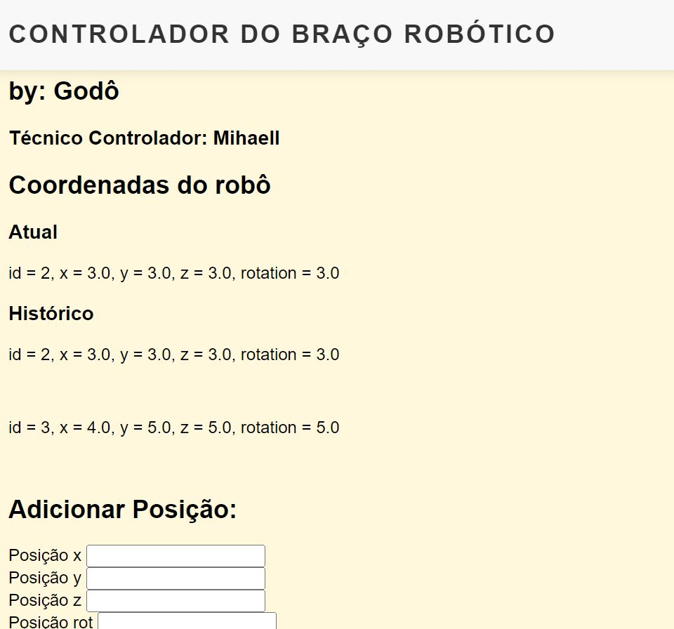
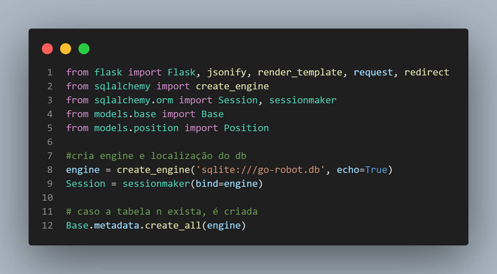
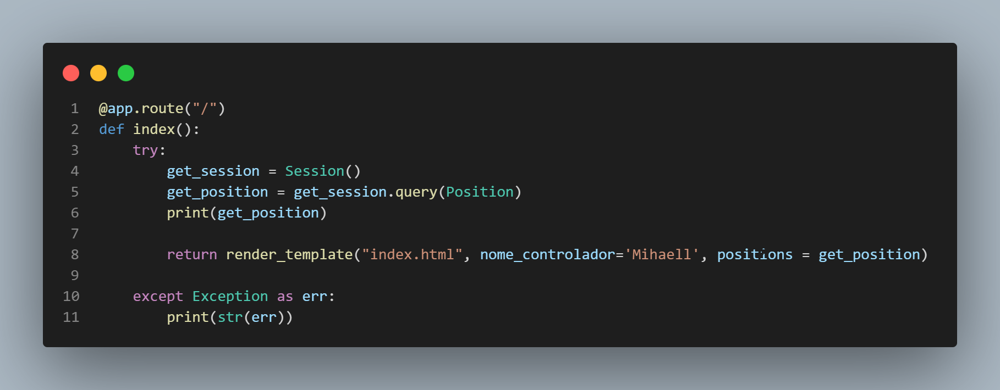
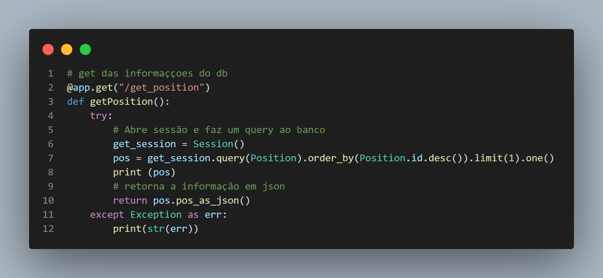
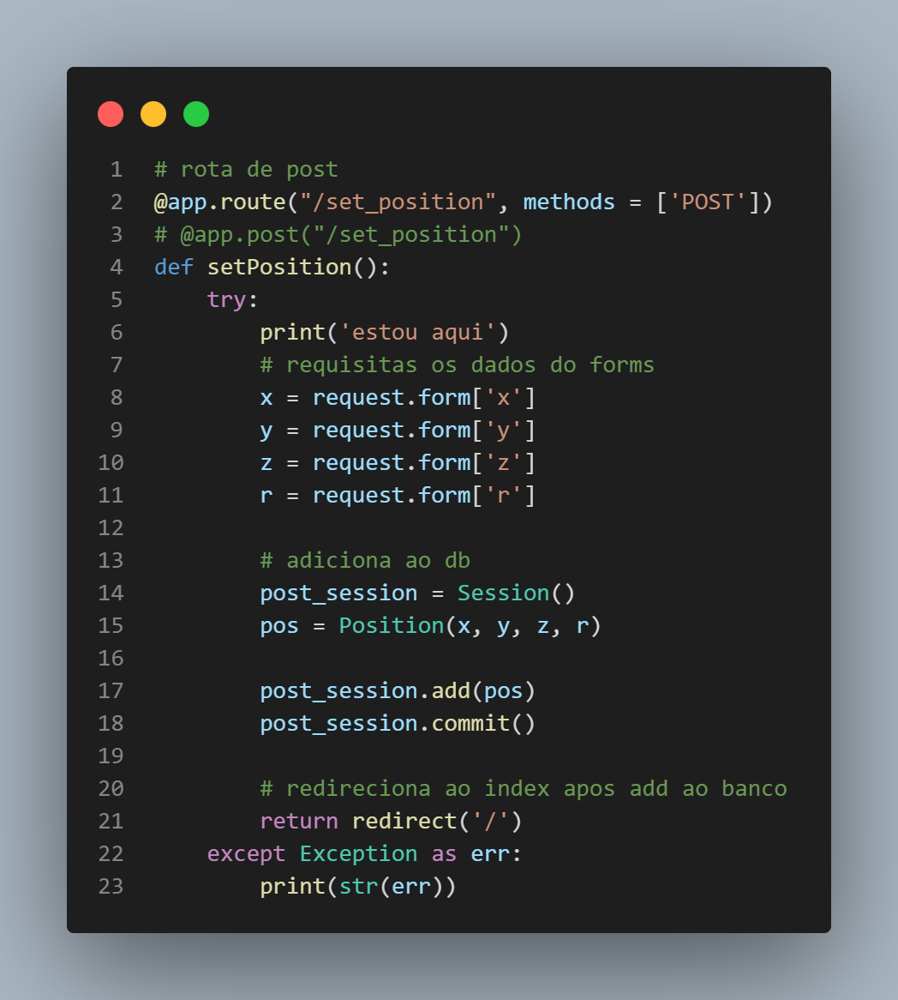
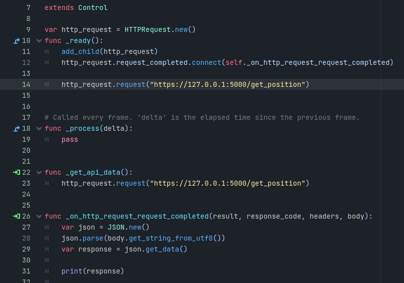
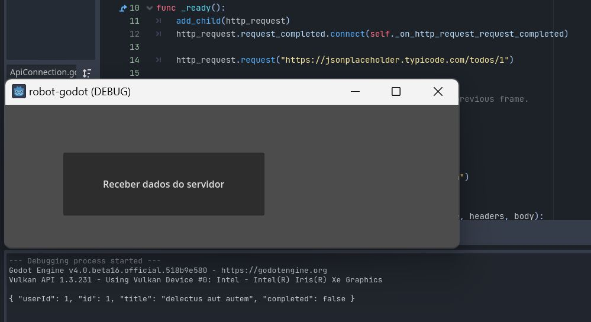
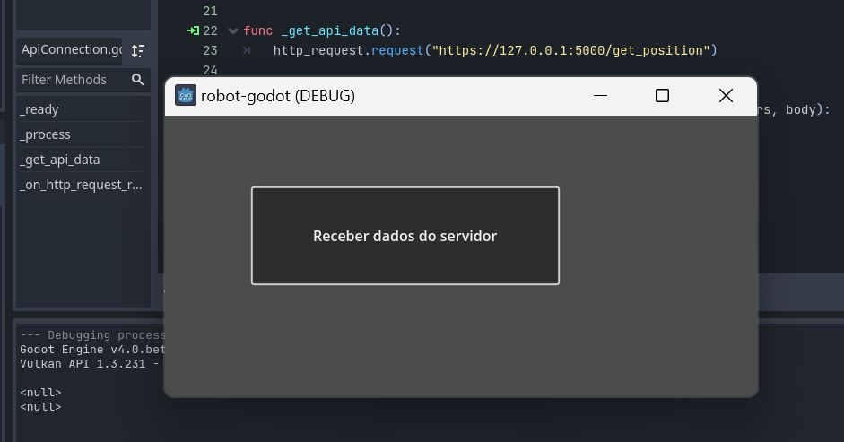
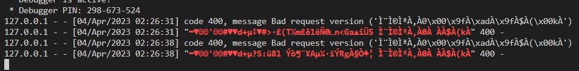

# Simulação de braço robótico integrado com backend

Usando a game engine Godot, foi simulada o controle de posição de um braço robótico controlado através de um servidor local. Tecnologias utizadas:
* Game Engine Godot 
* Frontend - HTML
* Backend - Flask
* Database - SQLAlchemy

# Frontend
Criado de forma simples com HTML puro, a pagina contém:
* Coordenadas atual e histórico do braço
* Inputs para a nova posição (x,y,z,rotação)

# Backend
## Inicializando o servidor
O primeiro passo é ativar o ambiente virtual do python, usando o comando abaixo, no prompt:

`robot-godot\Scripts>activate`

Por último rodamos o arquivo 'main.py' usando o comando:
`robot-godot>python ./src/main.py`

Pronto, agora o servidor está rodando no endereço localhost na porta 5000, ou também:

'http://127.0.0.1:5000'

## Criação do banco de dados
No código principal, primeiro importamos todas as bibliotecas necessárias. Após isso, inicializamos o banco de dados e caso ele não exista no projeto, será criado

No código de modelos, criamos a tabela 'Position'

## Rotas

### Index
A rota index ("/") tem como função acessar o banco de dados e fazer uma query das posições.
No fim ela retorna o html da página através do render_template

A rota get do backend ("/get_position") tem como função, abrir o banco de dados e fazer uma query ordenada pelo id em ordem decrescente limitada apenas ao primeiro elemento

A rota de post do backend ("/set_position"), primeiro armazena os valores que o usuario digitou no forms do frontend e, depois de abrir o banco de dados, os armazena nele. Após isso ele redireciona para o index

# Simulação no godot
Para um teste inicial do HTTPRequest no godot organizei uma cena básica com um botão que ao ser pressionado executa o request

Ao testar a requisição em um endereço de json placeholder, podemos observar que temos exito na execução

Porém executar o request no endereço do servidor flask `<null>` é retornado, apesar da rota estar funcionando em testes feitos no postman e no proprio frontend

E essa é a mensagem de erro no servidor

